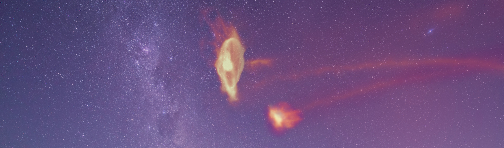

## Hello, I'm Scott!

I am an astrophysicist, photographer, programmer, car enthusiast, and dancer. I am a full-time PhD student at the University of Wisconsin - Madison in the Department of Physics. I have significant experience in software development and programming through my physics and astronomy research as well as through my work at a software startup.

You can find more info about me at my website: [https://www.scottlucchini.com](https://www.scottlucchini.com) ([source](https://github.com/slucchini/slucchini.github.io)). And more info about the research my collaboratos and I are doing here: [https://www.madastrodynamics.com](https://www.madastrodynamics.com).

<!--
**slucchini/slucchini** is a ✨ _special_ ✨ repository because its `README.md` (this file) appears on your GitHub profile.

Here are some ideas to get you started:

- 🔭 I’m currently working on ...
- 🌱 I’m currently learning ...
- 👯 I’m looking to collaborate on ...
- 🤔 I’m looking for help with ...
- 💬 Ask me about ...
- 📫 How to reach me: ...
- 😄 Pronouns: ...
- ⚡ Fun fact: ...
-->
